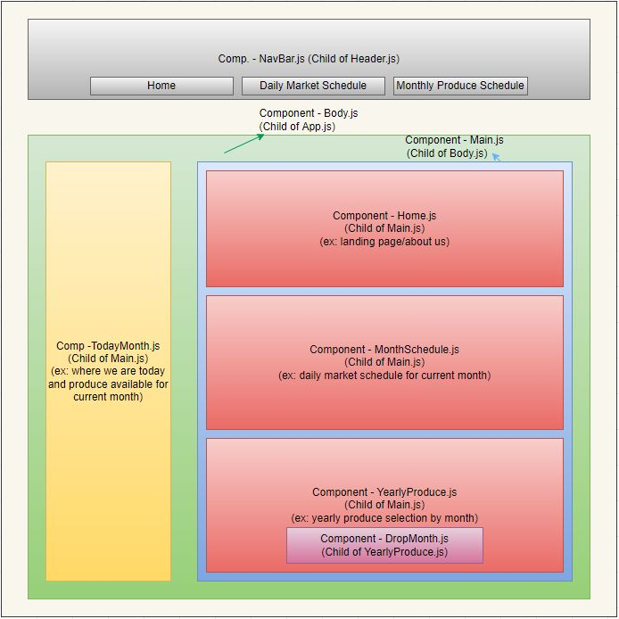

# Cage Free Farms

#### By Frank Proulx, Jeff Terrell, Colt Thatcher, Skylar Brockbank

#### A website for a farm that features Nic Cage

## Technologies Used

* HTML
* CSS
* Javascript
* NPM
* React

## Description

This website uses React to create a single page application that shows a farm's schedules for both market visits and seasonal produce. It also has a home page with about us info. The pages change dynamically based off which nab buttons are selected. There's also Nic Cage.

## Setup/Installation Requirements  

* Create and/or navigate to the directory you would like to contain this project on your computer.
* Initialize a git repository by typing git init in the terminal.
* Type git clone https://github.com/Frank-Proulx/w6-currency-exchanger to clone the repository to your local machine.
* Type npm install in the terminal to install all dependencies.  
* Type npm run start into the terminal to start a server displaying the page.

## Known Bugs

No known bugs.

## License

[MIT](https://opensource.org/licenses/MIT)

If you have any issues, questions, ideas or concerns, please reach out to me at my email and/or make a contribution to the code via GitHub.

Copyright (c) 2022 Frank Proulx, Jeff Terrell, Colt Thatcher, Skylar Brockbank